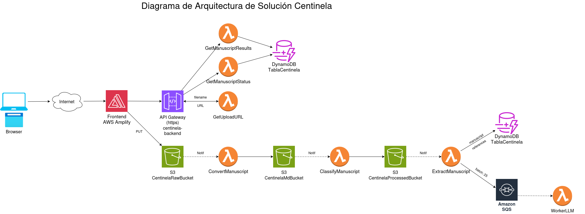

# 🛡️ Proyecto Centinela: Integridad Científica

"Centinela" es una plataforma Serverless diseñada para automatizar la verificación masiva de referencias bibliográficas, detectando "citas zombis" (artículos retractados que siguen siendo citados como válidos) y analizando el contexto de las citas mediante Inteligencia Artificial.

## 1. Visión y Problemática
La ciencia actual enfrenta una crisis de reproducibilidad. La citación activa de artículos retractados propaga información falsa en áreas sensibles como la medicina, biotecnología e ingeniería.

**Impacto:** "Centinela" garantiza un Índice de Integridad robusto para editoriales científicas y universidades al comprender no solo si una cita fue retractada, sino si el autor la utiliza legítimamente como error o ilegítimamente como evidencia.

## 2. Arquitectura de Solución
El sistema sigue un enfoque asíncrono, orientado a eventos (Event-Driven), garantizando alta escalabilidad, resiliencia ante límites de APIs externas y bajo costo operativo.

### Flujo de Datos
1. **Frontend (AWS Amplify)**: Ingesta de archivos mediante URL pre-firmada.
2. **Backend (Serverless)**:
    - **Converter**: Transforma documentos complejos a Markdown (optimización de tokens).
    - **Extractor**: Segmenta citas y las agrupa en lotes (Batching).
    - **Worker LLM**: Inferencia asíncrona mediante Groq para análisis de integridad.
3. **Persistencia**: DynamoDB con diseño *Single-Table* para seguimiento atómico.

## 3. Contrato de API
La comunicación se rige por HTTPS/REST y JSON. Los endpoints principales son:

| Endpoint | Método | Descripción |
| :--- | :--- | :--- |
| `/api/v1/manuscripts/upload-url` | POST | Inicia el proceso y obtiene URL de subida |
| `/api/v1/manuscripts/{id}` | GET | Consulta el estado del procesamiento (Polling) |
| `/api/v1/manuscripts/{id}/results` | GET | Obtiene la lista final de resultados |

*(Para detalles de estructuras JSON, consultar [`API_CONTRACT.md`](API_CONTRACT.md))*.

## 4. Diaframa de Arquitectura de Solución



## 5. Manual de Despliegue

### Requisitos Previos
* Node.js (v18+)
* Serverless Framework (`npm install -g serverless`)
* AWS CLI configurado
* Python 3.14

### Pasos de Despliegue
1. **Configuración de variables**: Copia el archivo `env.example` a `.env` y configura tus credenciales de Groq:
   ```bash
   cp env.example .env
   ```

2. **Preparación de Dependencias**: Instala las dependencias necesarias respetando los límites de AWS Lambda (250MB):
    ```bash
    chmod +x build_deps.sh
    ./build_deps.sh
    ```
3. **Despliegue de Infraestructura**:
    ```bash
    sls deploy --stage dev
    ```
